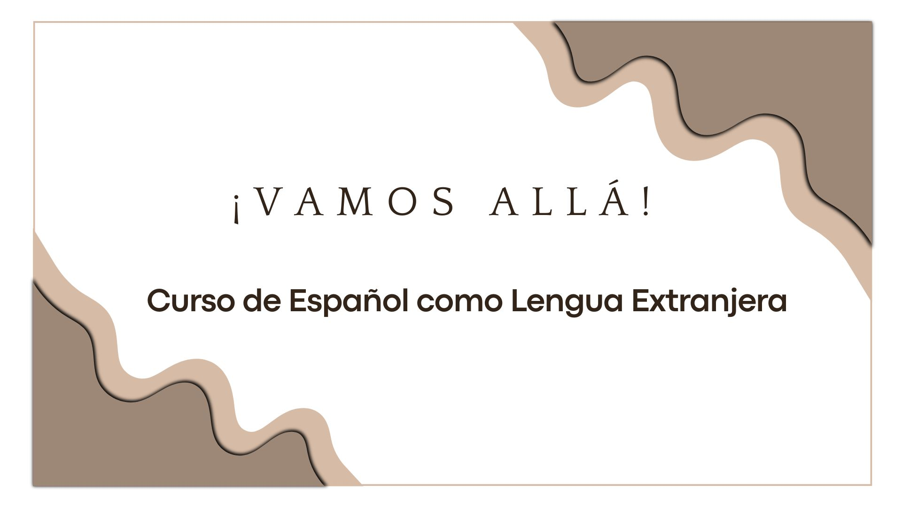

## Curso Español como Lengua Extranjera

### Presentación del curso
- [Presentación del curso](./00-Introduccion/README.md)
- [Presentación (PDF)](./00-Introduccion/dist/Presentacion.pdf)

### Contenidos
- [Tema 1 - Lecciones](./01-Lecciones/)
- [Tema 2 - Casos Gramaticales](./02-Casos-Gramaticales/)
- [Tema 3 - Guía de viaje](./03-Guia%20de%20viaje/)
- [Tema 4 - Narrativa Interactiva](./04-Narrativa%20Interactiva/)

### Presentación del curso
- [Presentación del curso](./00-Introduccion/README.md)
- [Presentación (PDF)](./00-Introduccion/dist/Presentacion.pdf)
- 

### Contenidos
### [Tema 1 - Lecciones](./01-Lecciones/)
### [Tema 2 - Casos Gramaticales](./02-Casos-Gramaticales/)
- [Tema 3 - Guía de viaje](./03-Guia%20de%20viaje/)
- [Tema 4 - Narrativa Interactiva](./04-Narrativa%20Interactiva/)